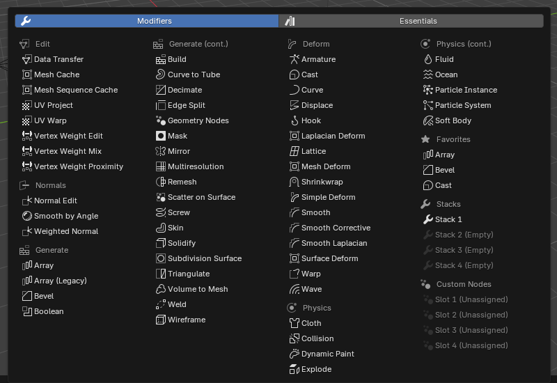
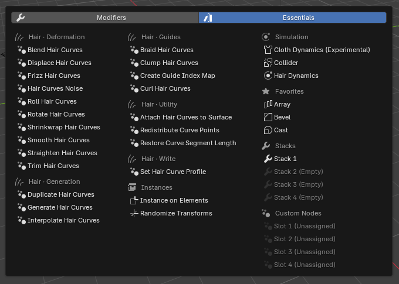
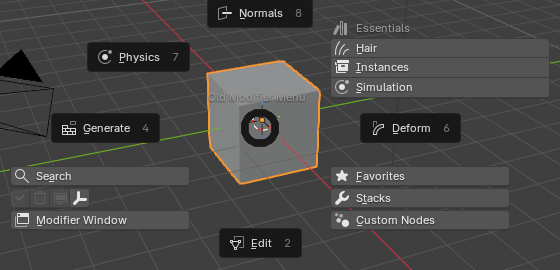
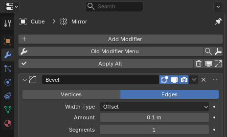
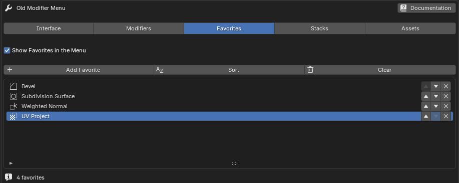
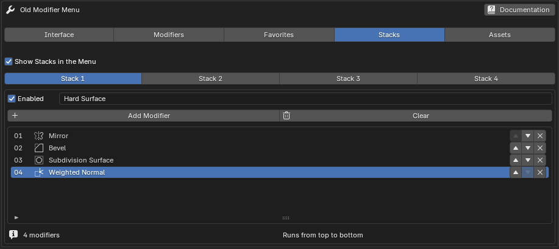
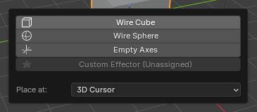
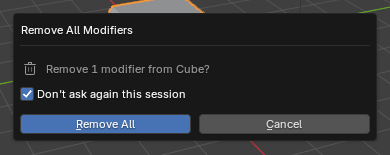
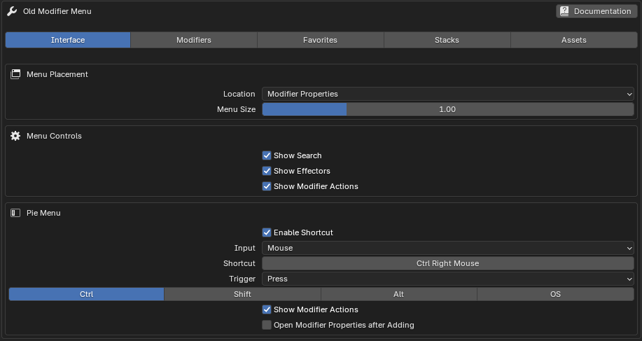
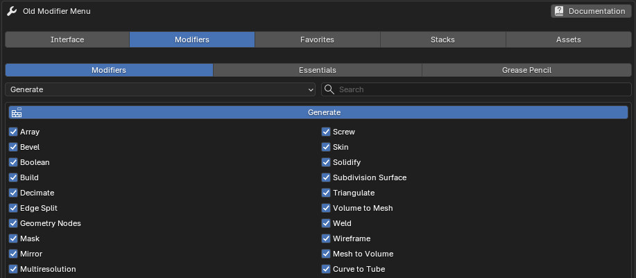

# Old Modifier Menu — User Guide

Old Modifier Menu brings back Blender's traditional modifier menu with visible, organized categories. It adapts to the active object and supports meshes, curves, surfaces, text, lattices, volumes, hair curves, and Grease Pencil objects.

The comparison below summarizes the available editions. The remaining sections describe the complete feature set.

## Edition comparison

| Feature | Lite | Paid |
|---|:---:|:---:|
| Object-aware modifier menu | Yes | Yes |
| Mesh, Curve, Surface, Text, Lattice, Volume, Hair, and Grease Pencil support | Yes | Yes |
| Menu-location and size controls | Yes | Yes |
| Blender Essentials Geometry Nodes integration | Yes | Yes |
| Modifier Search button | — | Yes |
| Configurable pie menu | — | Yes |
| Favorites | — | Yes |
| Four reusable modifier Stacks | — | Yes |
| Four custom Geometry Nodes slots | — | Yes |
| Built-in and custom effectors | — | Yes |
| Apply, remove, enable/disable, and expand/collapse all | — | Yes |
| Detailed category and individual-modifier visibility controls | Basic | Yes |

Install only one edition at a time; one edition replaces the other.

## Installation

Old Modifier Menu supports **Blender 4.3 or later**. Individual Essentials assets have additional version requirements described under [Blender Essentials assets](#blender-essentials-assets).

1. Download the ZIP for your edition.
2. Leave the downloaded file as a ZIP. Do not extract or rearrange its contents.
3. Open Blender.
4. Choose **Edit → Preferences → Get Extensions**.
5. Open the menu in the upper-right corner of the Extensions view.
6. Choose **Install from Disk**.
7. Select the Old Modifier Menu ZIP.
8. Enable **Old Modifier Menu** if Blender does not enable it automatically.
9. Select a supported object and verify that the menu appears in the configured location.

For an existing installation, follow [Updating or changing editions](#updating-or-changing-editions) to choose the matching ZIP and retain your settings.

## Updating or changing editions

Old Modifier Menu settings—including Favorites, Stacks, shortcut choices, and custom paths—are stored in Blender preferences. They are not stored in the current `.blend` scene.

To update the same edition:

1. Download the update ZIP that matches your installed extension.
2. Use **Install from Disk** to install it over the existing extension. Do not uninstall first.
3. Check that your Favorites, Stacks, shortcut, and custom paths are retained.
4. Use **Save Preferences** if Blender's automatic preference saving is disabled.

If your download contains both `old_modifier_menu_…zip` and `old_mod_menu_…zip`, install the file whose name matches your existing package. They contain the same complete edition. For a fresh installation, use `old_modifier_menu_…zip`.

When switching editions, record the settings you want to keep, remove the previous edition, and install the replacement. Settings are not guaranteed to transfer between editions. Install only one edition or compatibility package at a time.

## Quick start

1. Select a mesh object.
2. Find Old Modifier Menu in its configured location.
3. Click the main modifier icon to open the categorized menu.
4. Choose a modifier such as **Bevel**, **Mirror**, or **Subdivision Surface**.
5. Adjust the newly added modifier in Blender’s Modifier Properties.

Additional features described in this guide include:

- Click the magnifying-glass button to search compatible modifiers and supported node assets by name.
- Press **Ctrl + Right Mouse Button** in the 3D Viewport to open the pie menu.
- Configure Favorites, Stacks, effectors, and custom Geometry Nodes in the add-on preferences.

## Interface overview

### Main modifier button

The main button opens Old Modifier Menu for the active object. Use the page buttons to switch between:

- **Modifiers:** Edit, Generate, Deform, Normals, and Physics, or the applicable Grease Pencil categories.
- **Essentials:** Hair, Instances, and Simulation.

The menu adjusts to the available space. Use the arrow buttons to move between pages when needed.

=== "Modifiers"

    { .omm-ui-shot loading=lazy width=800 height=550 }

=== "Essentials"

    { .omm-ui-shot loading=lazy width=680 height=485 }

Categories and individual modifier entries can be enabled or disabled in the add-on preferences. The menu also adapts to the active object type, so it does not show choices that Blender does not support for that object.

### Search button

The magnifying-glass button opens the add-on's modifier search. Use **Interface → Menu Controls → Show Search** in the add-on preferences to display or hide this button.

### Effector button

The Effector button opens a popup for adding helper objects such as a Wire Cube, Wire Sphere, or Empty Axes. A cube or sphere can, for example, be positioned and used as a Boolean object, while Empty Axes can provide a non-rendering reference or control object. Custom helper objects can also be loaded from a `.blend` file. Use **Interface → Menu Controls → Show Effectors** to display or hide the button in the regular interface and pie menu.

### Modifier actions {#extras-row}

**Apply All**, **Remove All**, and **Toggle Visibility** are available in Modifier Properties, the toolbar, and the header. **Expand / Collapse** is available only in Modifier Properties. Use **Interface → Menu Controls → Show Modifier Actions** to display or hide these controls.

The pie menu has its own **Show Modifier Actions** setting under **Interface → Pie Menu**.

### Modifier Window button

Click **Modifier Window** in the pie menu, or the window icon in the toolbar or header, to open Modifier Properties for the active object. See [Opening a separate Properties window](#opening-a-separate-properties-window).

### Menu locations

Choose **Interface → Menu Placement → Location** in the add-on preferences:

- **Modifier Properties:** Places the interface below Blender's default Add Modifier button.
- **3D View Toolbar:** Places the controls vertically in the 3D Viewport toolbar.
- **3D View Header:** Places compact icon buttons in the 3D Viewport header.

**Menu Size** changes button height in Modifier Properties and the toolbar. In the header, the setting becomes **Button Width** and changes width without increasing the header's height. Toolbar and header icons retain a minimum button size to keep them distinct and clickable.

## Adding modifiers

### From the categorized menu

1. Select a supported object.
2. Open Old Modifier Menu.
3. Choose **Modifiers** or **Essentials**, then locate the required category. Use the page arrows if needed.
4. Click the modifier name.

The modifier is added to the active object. Old Modifier Menu does not replace Blender’s modifier settings; configuration continues in Blender’s normal Modifier Properties.

Press **Right Mouse Button** or **Esc** to close the menu without adding anything. The same cancellation controls work in modifier searches and the Effector popup.

### Object-aware choices

Blender does not support every modifier on every object type. Old Modifier Menu therefore shows a tailored subset rather than the full mesh list everywhere.

Examples:

- Meshes expose the widest set of Edit, Generate, Deform, Normal, and Physics modifiers.
- Curves and text show only modifiers Blender supports for those objects.
- Volumes include volume-specific conversion and deformation choices.
- Hair curves expose Blender Essentials hair-node assets.
- Grease Pencil objects use their own modifier categories.

### Selection requirements

The operation acts on the active object. If several objects are selected, only the active object receives the chosen modifier.

If no compatible active object exists, relevant operators are disabled and the add-on reports **Select an editable object that supports modifiers**.

## Search

Search lists native modifiers and the node assets supported by Old Modifier Menu, filtered for the active object and the available Blender libraries. Results use readable modifier names and are sorted alphabetically.

To use Search:

1. Select a supported object.
2. Click the magnifying-glass button.
3. Type part of a modifier’s name.
4. Select the required result.

The regular interface and pie-menu Search use the same list. Category and individual visibility settings control the menus; they do not hide compatible results from Search.

Search does not index arbitrary external Asset Browser libraries. Configure your own Geometry Nodes groups in the four [Custom Node Modifier slots](#custom-node-modifiers). Favorites and Stack searches select native modifier types, rather than saving configured modifier settings or node assets.

Press **Right Mouse Button** or **Esc** to cancel without adding a modifier or changing a saved list.

## Pie menu

### Opening the pie menu

The default shortcut is **Ctrl + Right Mouse Button** while the cursor is over the 3D Viewport.

The pie menu provides quick access to modifier categories and other Old Modifier Menu tools. Hair, Instances, and Simulation are grouped under **Essentials**.

{ .omm-ui-shot loading=lazy width=560 height=270 }

### Changing the shortcut

1. Open the Old Modifier Menu preferences.
2. Choose **Interface → Pie Menu**.
3. Turn on **Enable Shortcut**.
4. Set **Input**, **Shortcut**, and **Trigger**, then choose any **Ctrl**, **Shift**, **Alt**, or **OS** modifiers.

Turning off **Enable Shortcut** disables the binding. Re-enabling it restores the configured shortcut.

### Opening a separate Properties window

**Open Modifier Properties after Adding**, under **Interface → Pie Menu**, controls automatic opening after adding a modifier from the pie's category lists, Favorites, Stacks, or Custom Nodes. It is enabled by default. Search adds its selected modifier without automatically opening the window.

Turn this setting off to keep working in the existing interface. You can still open the window manually with **Modifier Window** in the pie or the window icon in the toolbar or header.

The separate editor is pinned to the selected object. Opening it again reuses the same window and updates the pinned object.

{ .omm-ui-shot .omm-ui-shot--compact loading=lazy width=464 height=280 }

## Favorites

Favorites provide quick access to individual modifiers you use frequently.

### Enabling Favorites

1. Open the **Favorites** tab in the add-on preferences.
2. Enable **Show Favorites in the Menu**.
3. Click **Add Favorite**.
4. Search for and select a modifier.

The selection is added only after you choose a modifier. Cancelling the search does not create an entry.

[{ .docs-shot loading=lazy width=917 height=367 }](../assets/images/old-modifier-menu/preferences-favorites-crop.png)

### Managing Favorites

Use the up/down arrows and **X** beside each entry to:

- Move the Favorite up.
- Move the Favorite down.
- Remove the Favorite.

Use **Sort** to order Favorites alphabetically, or **Clear** to remove the complete list after confirmation. Favorite choices use Blender's readable modifier names.

### Applying a Favorite

1. Select a compatible object.
2. Open Old Modifier Menu or the pie menu.
3. Open the Favorites section.
4. Click a Favorite.

The selected modifier is added to the active object. Incompatible Favorites are disabled for the current object.

## Modifier Stacks

A Stack is an ordered preset that adds several modifiers in one action. Four independent Stack slots are available.

### Creating a Stack

1. Open the **Stacks** tab in the add-on preferences.
2. Enable **Show Stacks in the Menu**.
3. Select one of the four Stack tabs and turn on **Enabled**.
4. Enter a descriptive Stack name.
5. Click **Add Modifier** for that Stack.
6. Search for and select a modifier.
7. Repeat until the modifiers appear in the required order.

The visible order is the order in which modifiers are created on the object. Use the arrows beside an entry to move it up or down, or **X** to remove it. A Stack stores modifier types and their order; it does not capture settings from an existing object's modifiers.

[{ .docs-shot loading=lazy width=917 height=409 }](../assets/images/old-modifier-menu/preferences-stacks-crop.png)

### Running a Stack

1. Select an object compatible with every modifier in the Stack.
2. Open the Stacks section in the regular menu or pie menu.
3. Click the saved Stack name.

Each modifier is added to the active object in the saved order. Running a Stack is one scene operation, so **Undo** removes that addition in one step.

### Clearing a Stack

Select the required Stack in preferences, click **Clear**, and confirm. This clears its modifier list without deleting or renaming the Stack slot.

### Empty or invalid Stacks

An empty Stack has **(Empty)** after its name and is disabled. Stacks with entries that are incompatible with the active object are also disabled.

If a Stack cannot be added, Blender reports the incompatible entry and leaves the object's existing modifiers unchanged.

## Custom Node Modifiers

Four configurable shortcuts are available for Geometry Nodes groups stored in your own `.blend` asset files.

### Configuring a slot

1. Open the **Assets** tab in Old Modifier Menu preferences.
2. Enable **Show Custom Node Modifiers**.
3. Choose one of the four **Custom Node Modifier** slots.
4. Set **Blend File** to the source `.blend` file.
5. Set **Node Group** to the exact node-group datablock name.
6. Enable that slot.

### Using a custom node modifier

1. Select an object that supports Geometry Nodes modifiers.
2. Open Old Modifier Menu or its pie menu.
3. Find **Custom Node Modifiers** in the main menu or open **Custom Nodes** in the pie.
4. Click the configured node-group name.

The add-on appends the node group and creates a Geometry Nodes modifier that uses it. If a Geometry Nodes group with the same name already exists in the current file, that existing group is reused. The node group must have a Geometry output.

### Path behavior

The file path can be absolute or use a Blender-resolved path. Select an existing readable `.blend` file and provide a node-group name before enabling the slot.

### Name matching

Node-group names must match the source datablock name exactly, including spaces and capitalization. The label visible in a node editor is normally the name to use.

## Blender Essentials assets

Old Modifier Menu provides access to selected Blender Essentials Geometry Nodes assets without requiring custom file paths. Availability depends on the running Blender version, its asset libraries, and the active object.

| Menu group | Assets | Availability |
|---|---|---|
| **Modifiers → Normals** | Smooth by Angle | Supported Blender 4.3 and later installations. |
| **Modifiers → Generate** | Array, Curve to Tube, Scatter on Surface | Blender 5.0 or later. |
| **Essentials → Hair** | Procedural hair groups listed below | Supported Blender 4.3 and later installations; Hair is off by default. |
| **Essentials → Instances** | Instance on Elements, Randomize Transforms | Blender 5.0 or later. |
| **Essentials → Simulation** | Hair Dynamics, Collider, Cloth Dynamics (Experimental) | Requires the Blender 5.2 Essentials simulation library. |

Hair, Instances, and Simulation use the same Essentials grouping in preferences, the main menu, and the pie. Smooth by Angle and the Generate assets stay with their corresponding modifier categories. When the Essentials Array is available, the traditional Array modifier is labeled **Array (Legacy)**.

## Hair curve assets

Hair curve features use Blender Essentials Geometry Nodes groups. Open **Modifiers → Essentials → Hair** in the add-on preferences and enable **Show Hair in the Menu**. Use **Hair Category** to choose a group, then enable its category and individual assets.

Hair is disabled by default. Enable it to show your selected Hair assets under **Essentials**.

### Deformation

- Blend Hair Curves
- Displace Hair Curves
- Frizz Hair Curves
- Hair Curves Noise
- Roll Hair Curves
- Rotate Hair Curves
- Shrinkwrap Hair Curves
- Smooth Hair Curves
- Straighten Hair Curves
- Trim Hair Curves

### Generation

- Duplicate Hair Curves
- Generate Hair Curves
- Interpolate Hair Curves

### Guides

- Braid Hair Curves
- Clump Hair Curves
- Create Guide Index Map
- Curl Hair Curves

### Utility

- Attach Hair Curves to Surface
- Redistribute Curve Points
- Restore Curve Segment Length

### Write

- Set Hair Curve Profile

Compatible built-in modifiers remain on the Modifiers page. Asset visibility also depends on the selected object type and available Blender libraries.

## Effectors

Effectors are helper objects added to the current scene. They can be used as Boolean objects, modifier controls, placement references, or other non-rendering helpers.

### Included effectors

- Wire Cube
- Wire Sphere
- Empty Axes

To add one, click the Effector button in the regular interface or pie and select the desired helper. Press **Right Mouse Button** or **Esc** to close the popup without adding an object.

{ .omm-ui-shot loading=lazy width=365 height=160 }

### Effector location

Choose **Assets → Effectors → Placement** in the add-on preferences:

- **3D Cursor:** Places the appended object at the 3D Cursor.
- **Active Object:** Places it at the selected object's location. If no object is selected, it uses the world origin.
- **World Origin:** Places it at `(0, 0, 0)`.

### Custom effectors

To add your own helper object:

1. Open **Assets → Effectors** and set **Custom Blend File** to an existing `.blend` file.
2. Set **Object Name** to the exact object datablock name.
3. Open the Effector popup.
4. Click the custom entry.

The source object is appended rather than linked, so the new scene object is local to the current file.

## Modifier-management tools

Use **Show Modifier Actions** under **Interface → Menu Controls** for Modifier Properties, the toolbar, and the header. The pie has its own toggle under **Interface → Pie Menu**. These operations affect the active object's modifiers.

### Apply All

In **Object Mode**, applies viewport-enabled modifiers in order where Blender allows it. Disabled modifiers and modifiers that cannot be applied are kept, with a report identifying those that remain.

This operation changes object data and should be treated as destructive.

### Remove All

Removes every modifier from the active object after confirmation. The dialog shows the target object and modifier count.

Enable **Don't ask again this session** in that dialog, then confirm removal, to skip further Remove All confirmations until Blender restarts.

{ .omm-ui-shot loading=lazy width=390 height=155 }

### Enable/Disable All

Sets viewport visibility for every modifier on the active object. If any modifier is visible, the action hides them all; if all are hidden, it shows them all. It does not change their render visibility.

### Expand/Collapse All

Available only in **Modifier Properties**. If any modifier panel is expanded, the action collapses all panels; otherwise, it expands them all. This control is not shown in the toolbar, header, or pie.

Save the file before Apply All or Remove All, or be prepared to use Blender’s Undo command.

## Object and modifier reference

The exact menu is object-dependent. This reference summarizes the full set represented by the add-on; Blender decides which choices are valid for each object type.

### Mesh categories

**Edit**

- Data Transfer
- Mesh Cache
- Mesh Sequence Cache
- UV Project
- UV Warp
- Vertex Weight Edit
- Vertex Weight Mix
- Vertex Weight Proximity

**Generate**

- Array
- Bevel
- Boolean
- Build
- Curve to Tube
- Decimate
- Edge Split
- Geometry Nodes
- Mask
- Mirror
- Multiresolution
- Remesh
- Scatter on Surface
- Screw
- Skin
- Solidify
- Subdivision Surface
- Triangulate
- Volume to Mesh
- Weld
- Wireframe

The node-based Array, Curve to Tube, and Scatter on Surface require Blender 5.0 or later. The traditional Array remains available and is labeled **Array (Legacy)** when the node asset is present.

**Deform**

- Armature
- Cast
- Curve
- Displace
- Hook
- Laplacian Deform
- Lattice
- Mesh Deform
- Shrinkwrap
- Simple Deform
- Smooth
- Smooth Corrective
- Smooth Laplacian
- Surface Deform
- Warp
- Wave

**Normals**

- Normal Edit
- Weighted Normal
- Smooth by Angle

**Physics**

- Cloth
- Collision
- Dynamic Paint
- Explode
- Fluid
- Ocean
- Particle Instance
- Particle System
- Soft Body

### Curve and Text objects

Curve and Text menus expose relevant subsets of Edit, Generate, Deform, and Soft Body tools. Unsupported mesh-only choices are omitted.

### Lattice objects

Lattices receive compatible cache, deformation, and Soft Body choices.

### Volume objects

Volume objects expose Mesh to Volume, Volume Displace, Mesh Sequence Cache, and Geometry Nodes where supported. Volume to Mesh belongs to the mesh object's modifier list.

### Hair Curves

Hair Curves combine compatible built-in modifiers with the enabled Blender Essentials hair assets described above.

### Grease Pencil categories

Old Modifier Menu represents Blender’s Grease Pencil modifiers in these groups:

- **Edit:** Texture Mapping, Time Offset, Vertex Weight Proximity, and Vertex Weight Angle.
- **Generate:** Array, Build, Dot Dash, Envelope, Length, Line Art, Mirror, Multiple Strokes, Outline, Geometry Nodes, Simplify, and Subdivide.
- **Deform:** Armature, Hook, Lattice, Noise, Offset, Shrinkwrap, Smooth, and Thickness.
- **Color:** Hue, Opacity, and Tint.

Only choices supported by the active Blender version and enabled in the add-on preferences are displayed.

## Preferences reference

The preferences use five tabs:

| Tab | Contents |
|---|---|
| **Interface** | Menu placement and sizing, control visibility, pie shortcut, and automatic Properties-window opening. |
| **Modifiers** | Modifiers, Essentials, and Grease Pencil category and individual-entry visibility, with a text filter. |
| **Favorites** | Saved Favorite modifiers, ordering, sorting, and menu visibility. |
| **Stacks** | Four ordered modifier lists, names, per-slot controls, and menu visibility. |
| **Assets** | Four Custom Node Modifier slots and Effector configuration. |

=== "Interface"

    [{ .docs-shot loading=lazy width=917 height=487 }](../assets/images/old-modifier-menu/preferences-interface-crop.png)

=== "Modifier visibility"

    [{ .docs-shot loading=lazy width=917 height=401 }](../assets/images/old-modifier-menu/preferences-modifiers-crop.png)

Settings are stored in Blender preferences. Use **Save Preferences** if automatic saving is disabled. Editing these saved lists is separate from scene undo; adding a modifier or running a Stack can be undone in the scene.

### Add Effectors

- **Interface → Menu Controls → Show Effectors:** Displays or hides the Effector button in the regular interface and pie.
- **Assets → Effectors → Placement:** Selects 3D Cursor, Active Object, or World Origin placement.
- **Custom Blend File:** Selects the source `.blend` file for a custom effector.
- **Object Name:** Identifies the exact object datablock to append.

### Menu Location

These controls are in **Interface**:

- **Location:** Chooses Modifier Properties, 3D View Toolbar, or 3D View Header.
- **Menu Size / Button Width:** Changes button height in Modifier Properties and the toolbar, or button width in the header. Header and toolbar icons keep a minimum usable button size.
- **Show Search:** Displays the modifier Search button in the regular interface and pie.
- **Show Modifier Actions:** Displays Apply All, Remove All, and visibility controls in the regular interface, plus Expand / Collapse in Modifier Properties only. It does not hide the toolbar/header window icon.

### Pie Menu

These controls are in **Interface → Pie Menu**:

- **Enable Shortcut:** Enables or disables the configured pie binding.
- **Input, Shortcut, Trigger:** Set the input type, key or button, and triggering event.
- **Ctrl, Shift, Alt, OS:** Set the required modifier keys.
- **Show Modifier Actions:** Displays Apply All, Remove All, and visibility in the pie. Effectors follows its own visibility setting; Modifier Window remains available.
- **Open Modifier Properties after Adding:** Automatically opens or reuses the separate Properties window after additions from the pie's category lists, Favorites, Stacks, or Custom Nodes.

### Category visibility

In the **Modifiers** tab, choose a family and category:

- **Modifiers:** Edit, Generate, Deform, Physics, and Normals.
- **Essentials:** Hair, Instances, and Simulation.
- **Grease Pencil:** Edit, Generate, Deform, and Color.

Use the category toggle to show or hide that group, or filter by a modifier or category name. Disabling a category removes its menu entries without changing existing modifiers.

### Individual modifier visibility

Each built-in modifier can be enabled or disabled separately. Use these controls to create a smaller menu containing only tools relevant to your workflow.

These visibility settings do not hide compatible results from the add-on's Search. Unavailable assets are disabled in preferences and omitted from the menus and Search.

### Favorites

- **Show Favorites in the Menu:** Enables the Favorites section.
- **Add Favorite:** Searches native modifier names.
- **Sort:** Orders Favorites alphabetically.
- **Clear:** Removes the saved list after confirmation.
- **Up/down arrows and X:** Reorder or remove individual entries.

### Stacks

- **Show Stacks in the Menu:** Enables the Stacks section.
- **Stack 1–4 tabs:** Select the list to edit.
- **Enabled and name:** Control the selected slot's visibility and display name.
- **Add Modifier / Clear:** Add entries or clear the selected list after confirmation.
- **Up/down arrows and X:** Change the order or remove individual entries. Stacks run from top to bottom.

### Custom Node Modifiers {#custom-node-mods}

These controls are in **Assets**:

- **Show Custom Node Modifiers:** Enables the menu section.
- **Custom Node Modifier 1–4:** Enables each slot.
- **Blend File / Node Group:** Store the source file and exact Geometry Nodes group name for each slot.

### Hair controls

These controls are in **Modifiers → Essentials → Hair**:

- **Show Hair in the Menu:** Enables Hair; off by default.
- **Hair Category:** Selects Deformation, Generation, Guides, Utility, or Write for editing.
- **Category and individual toggles:** Select the Hair assets shown in the menu. The main menu displays enabled entries directly on the Essentials page.

### Grease Pencil controls

In **Modifiers → Grease Pencil**, choose Edit, Generate, Deform, or Color, then set its category and individual modifier visibility.

## Uninstallation

1. Open **Edit → Preferences → Get Extensions**.
2. Find Old Modifier Menu.
3. Disable it.
4. Choose **Uninstall** or **Remove**.
5. Restart Blender before installing a different edition.

Uninstalling the add-on does not remove modifiers, node groups, or effector objects already saved inside your `.blend` files. It removes the interface and add-on preferences.

For a normal update, install the matching ZIP over the existing extension as described in [Updating or changing editions](#updating-or-changing-editions).

## Support and bug reports

For a useful bug report, include:

- Exact Blender version and build type.
- Old Modifier Menu version and edition.
- Operating system.
- Active object type.
- Menu location and relevant enabled features.
- Exact reproduction steps.
- Complete error message or screenshot.
- For custom assets: the configured path and datablock name.
