# RUNIC — User Guide

RUNIC creates editable lettering, runes, symbols, and decorative marks in Blender. Its generated geometry is controlled by Geometry Nodes, while the original curve or object remains available for further editing.

## Installation

1. Download the RUNIC release ZIP.
2. Leave the ZIP intact; do not extract or rearrange its contents.
3. In Blender, open **Edit → Preferences → Get Extensions**.
4. Open the menu in the upper-right corner and choose **Install from Disk**.
5. Select the RUNIC ZIP and enable **RUNIC** if Blender does not do so automatically.

## How RUNIC works

RUNIC starts from a curve, generated path, point object, selected mesh faces or edges, or a path drawn on a surface. It places font glyphs on that starting geometry and keeps the placement, text, and geometry controls available in the RUNIC panels.

The normal order of work is:

1. Create or select a path, object, or mesh selection.
2. Choose a font and text source.
3. Set placement and appearance.
4. Assign materials or generate UVs if needed.
5. Keep the RUNIC object editable, or create a separate finished mesh when the design is ready.

## Creating RUNIC objects

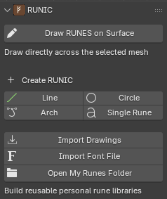{ .docs-shot .docs-shot--compact loading=lazy width=238 height=283 }

### Existing curve

Select a curve and click **Add RUNIC to Selected Curve**. The selected curve remains editable, including its multiple splines and closed paths.

### Line, Circle, Arch, and Single Rune

When no curve is selected, use a RUNIC preset:

- **Line** creates a straight editable path.
- **Circle** creates a closed circular path that can fill its circumference with symbols.
- **Arch** creates an editable curved path.
- **Single Rune** creates one editable point without a curve.

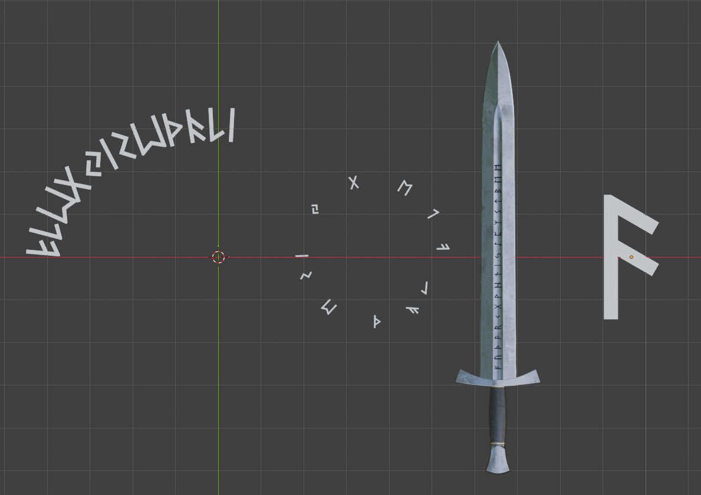{ .docs-shot loading=lazy width=1189 height=840 }

### Selected mesh edges

In **Edit Mode**, select one or more edges and click **RUNES along Selected Edges**. RUNIC creates an editable curve path from the edge selection.

### Selected mesh faces

In **Edit Mode**, switch to Face Select, select one or more faces, and click **RUNES on Selected Faces**. By default, RUNIC creates one placement for each selected face.

Use **Faces per Rune** to group adjacent selected faces into larger placement regions. **Fixed** uses one consistent rune size, while **Fit Faces** scales each rune to its face or grouped region. **Face Margin**, **Alignment**, **Rotate Rune**, and **Surface Offset** refine the result.

### Drawing on a mesh surface

Select a mesh in Object Mode and choose **Draw RUNES on Surface** to enter curve drawing mode.

RUNIC creates a curve path and uses the mesh as its surface target. For an existing curve and mesh, select exactly one of each and use **Add RUNIC to Curve on Surface** or **Attach to Selected Surface**.

Surface placement has two modes:

- **Clean** keeps each rune rigid while placing it against the surface. It is generally the clearest choice for hard-surface objects.
- **Wrap** bends rune points to follow the target more closely. It suits smoother organic forms but can distort symbols on tight or uneven geometry.

=== "Before Wrap"

    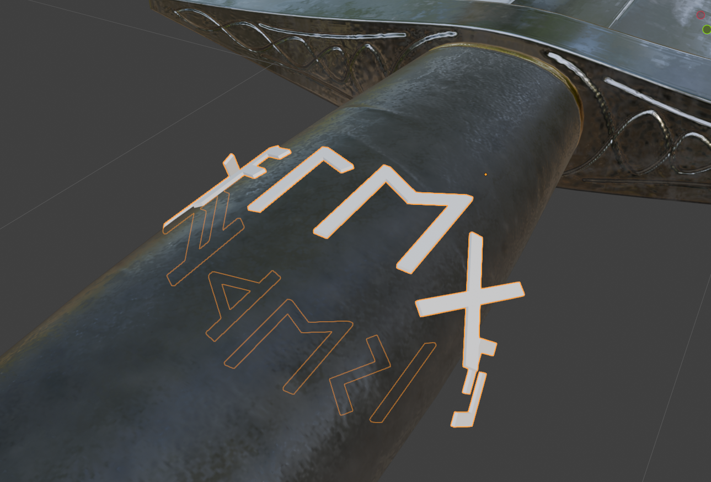{ .docs-shot loading=lazy width=1289 height=875 }

=== "After Wrap"

    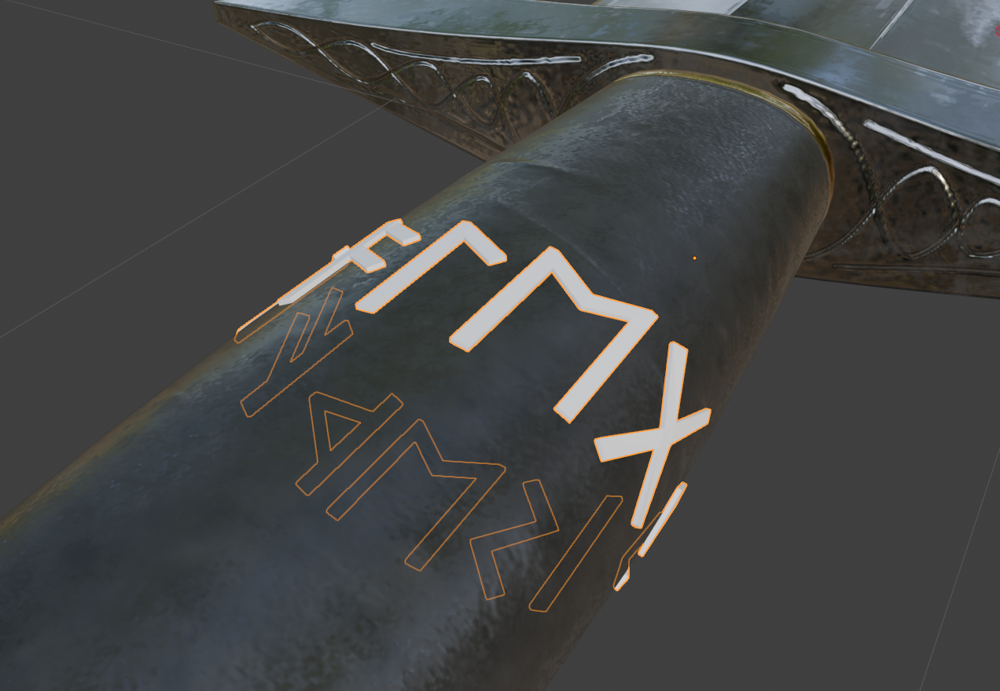{ .docs-shot loading=lazy width=1272 height=880 }

Use **Change Surface** to choose another target or **Detach from Surface** to remove surface attachment.

## Fonts and text sources

### Choosing a font

Click **Browse Fonts** to open the font browser. The bundled library is organized into:

- **Historical**
- **Magical**
- **Latin**
- **Fictional**
- **Decorative**
- **My Runes** for your imported libraries

Each font has its own preview card. Choose a font before setting up text or symbol content.

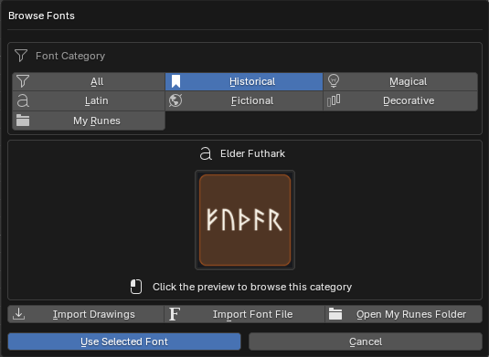{ .docs-shot .docs-shot--compact loading=lazy width=535 height=391 }

### Random

**Random** fills the selected path or object with valid symbols from the selected font. Set a **Seed** to make an arrangement repeatable; change the seed to generate a different arrangement.

The available placement points limit how many symbols can be placed. A Single Rune object or one-face rune object receives one symbol.

### Text

**Text** uses characters supported by the selected font. If the normal text option is unavailable, the font may be a symbols-only library rather than a conventional alphabet.

### Symbols

**Symbols** lets you select individual glyphs from the font browser. The gallery is based on the font's character map.

[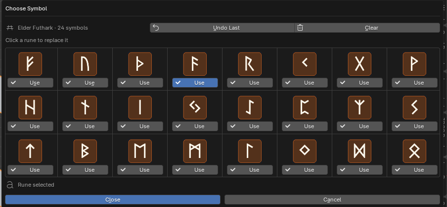{ .docs-shot loading=lazy width=904 height=418 }](../assets/images/runic/symbol-browser-crop.png)

### Phrase

Some fonts include prepared phrase sets. Choose a phrase from the **Phrase Bank** and RUNIC converts it to the associated font symbols.

Phrase mode is unavailable for a Single Rune object, a face-rune object with one selected face, or a font without a phrase set.

## Placement controls

### Paths and edges

Use **Fit Sizes to Path** when you want proportional starting values for rune size, spacing, offsets, depth, outline, bevel, and related controls. It makes a one-time adjustment; later edits remain under your control.

Use these controls to arrange runes along a curve or selected edges:

- **Rune Size** controls overall scale.
- **Character Spacing** adjusts the gap between glyphs.
- **Word Spacing** adjusts the gap between words.
- **Move Along Path** moves the whole arrangement along the path.
- **Move Across Path** moves runes sideways from the path.
- **Reverse Direction** flips the reading direction.
- **Roll Around Path** changes which way the rune surfaces face around the path.
- **Spin Each Rune** turns every symbol within its own plane. A 90-degree spin is useful for vertical rune strings.
- **Keep Clear of Ends** reserves empty space at open-path ends.
- **Avoid Sharp Corners** reduces crowding around sharp corners.
- **Fill Closed Path** distributes the result around a cyclic curve.

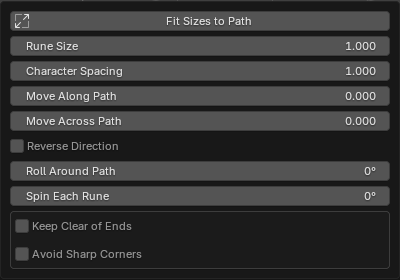{ .docs-shot .docs-shot--compact loading=lazy width=400 height=280 }

**Show Path Guide** displays temporary viewport-only guide points. They are not rendered, exported, or retained when the modifier is applied.

### Single Rune

Single Rune uses a procedural mesh point rather than a curve. Move, rotate, or scale its object using Blender's normal transform tools. Use **Rotate Rune** or **Spin Each Rune** for an additional turn within the point's plane. Phrase mode is unavailable because it has one placement point.

### Selected faces

Use **Fit Sizes to Faces** for proportional starting values based on the selected geometry. It also switches the result to **Fit Faces**.

- **Faces per Rune** groups connected faces into placement regions. A value of 2 places one rune across each pair of adjacent faces. Disconnected faces and sharply folded regions remain separate.
- **Upright** keeps every symbol upright relative to the source object.
- **Follow Faces** turns symbols along a connected strip, such as an arch or curved band. It changes their alignment without bending them.
- **Fixed** uses one consistent rune size.
- **Fit Faces** scales each rune proportionally to its face or grouped region.
- **Face Margin** adds space around a fitted rune. Enter a negative value to extend the rune beyond the normal fit area.
- **Rotate Rune** turns symbols within the face plane.
- **Surface Offset** moves the result away from or into the source faces.

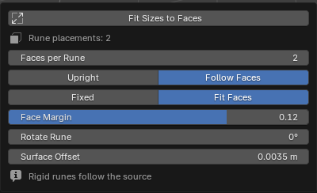{ .docs-shot .docs-shot--compact loading=lazy width=400 height=244 }

The **Rune placements** count in the Placement panel shows how many runes the current grouping creates. Simple connected face strips give the most predictable grouping.

## Appearance and geometry

Choose an appearance in the RUNIC panels:

- **Flat** creates a flat filled result.
- **Raised** creates closed geometry with depth.
- **Outline** creates an outline without a filled body.

### Outline cleanup and smoothing

The Appearance panel provides several controls for different kinds of shape cleanup:

- **Simplify Outline** reduces unnecessary points and small contour bumps. It is especially useful for symbols imported from drawings or scans. Start around 0.3–1 and increase gradually; higher values can remove intentional details or make curves more angular.
- **Remove Tiny Details** appears when **Simplify Outline** is above zero. Enable it when unwanted specks or pinholes remain, but check that intentional dots and openings are preserved.
- **Shape Smoothing** softens corners and uneven edges. High values can shrink thin strokes or change the silhouette, so increase it gradually.
- **Curved Edge Geometry**, under **Appearance → Advanced**, controls the geometry used for genuinely curved font edges. It does not remove noise from the source outline.
- **Font Repair**, also under **Appearance → Advanced**, targets tiny point clusters that can cause spikes or other artifacts in bevels and outlines. Start with **Safe**, then use a stronger mode only when the visible problem remains.

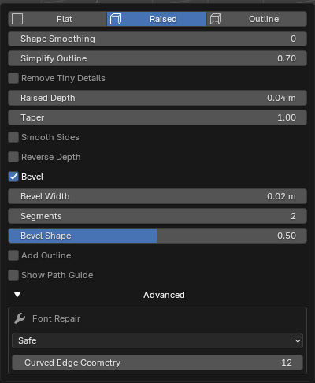{ .docs-shot .docs-shot--compact loading=lazy width=400 height=486 }

Reduce bevel or outline width if fine details collapse. Use **Clean** rather than **Wrap** if surface symbols become visibly distorted.

=== "Artifacts visible"

    [{ .docs-shot loading=lazy width=670 height=400 }](../assets/images/runic/font-repair-before-detail.png)

=== "After repair"

    [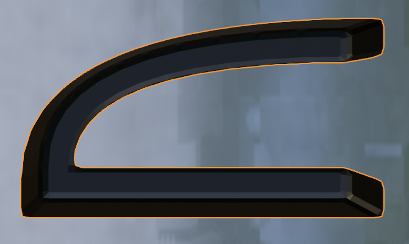{ .docs-shot loading=lazy width=670 height=400 }](../assets/images/runic/font-repair-after-detail.png)

### Raised geometry

**Raised Depth** controls the thickness of a raised rune. Enable **Reverse Depth** to build that thickness on the opposite side of the rune's base while retaining outward-facing normals. On a surface-attached object, reversed geometry may extend inside the target and become hidden.

Reverse Depth does not engrave or cut the source object. Use the raised rune with Blender's Boolean tools when you need recessed geometry.

## Materials, UVs, and finished meshes

The **Materials** panel can assign separate materials to:

- **Faces** for front or base rune faces.
- **Sides** for raised or surface side walls.
- **Outline** for outline geometry.

If a side or outline material is empty, RUNIC reuses the face material.

The **Finish** panel includes:

- **Generate UV Map** to create and pack UVs for texturing or export.
- **UV Margin** to control space between packed UV islands.
- **Create Finished Mesh** to make a separate ordinary mesh copy while leaving the original RUNIC object editable.
- **Remove RUNIC** to remove RUNIC's procedural setup while keeping the original editable object in the scene. This does not create a finished mesh copy.

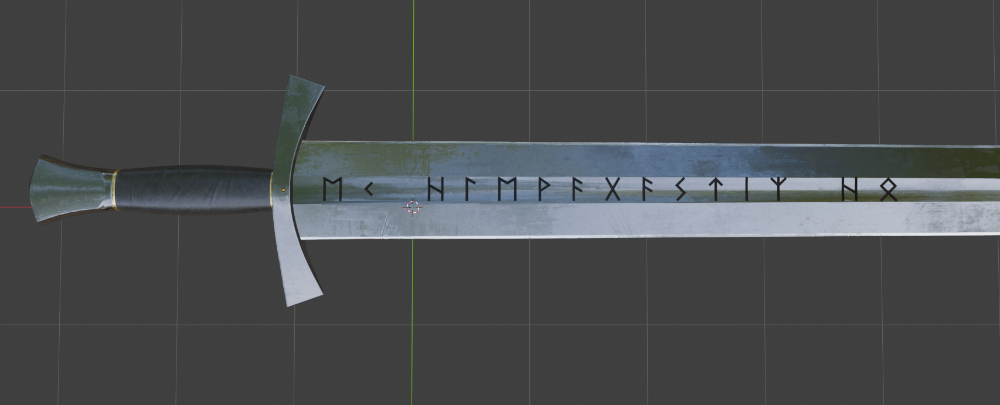{ .docs-shot loading=lazy width=1706 height=691 }

## Personal libraries

### Importing a font

Choose **Import Font File** and select an OTF or TTF font. RUNIC inspects its character map and opens a review gallery.

Use the review gallery to choose whether the library should provide **Text + Symbols** or **Symbols Only**, select the glyphs you need, and save the result as a reusable entry under **My Runes**.

### Importing hand-drawn symbols

Choose **Import Drawings** and select a PNG, JPG, JPEG, TIFF, or TIF image. The review workflow can treat the image as one rune, find separate marks automatically, or divide a regular sheet into rows and columns.

Use the controls to invert artwork, adjust threshold and speck cleanup, join gaps, set padding and cell edges, control tracing detail, and approve or ignore detected runes. RUNIC turns the approved drawings into vector contours and stores them as a reusable personal library.

For a regular sheet like this example, choose **Even Grid** and set the number of rows and columns. Separate dots and strokes within a cell remain part of the same rune.

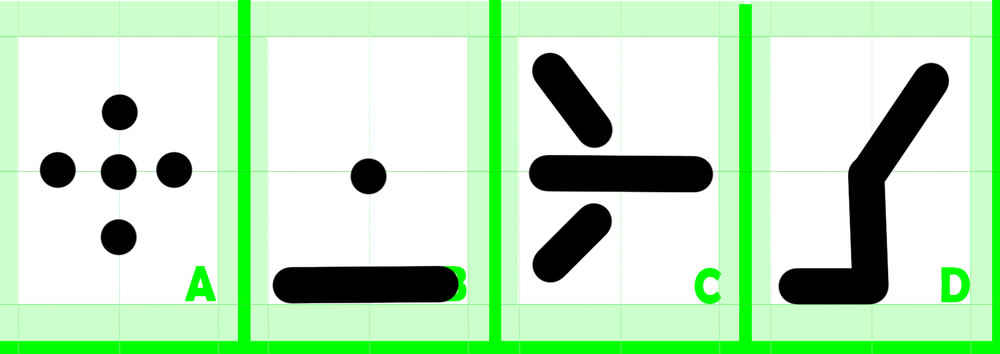{ .docs-shot loading=lazy width=1000 height=354 }

[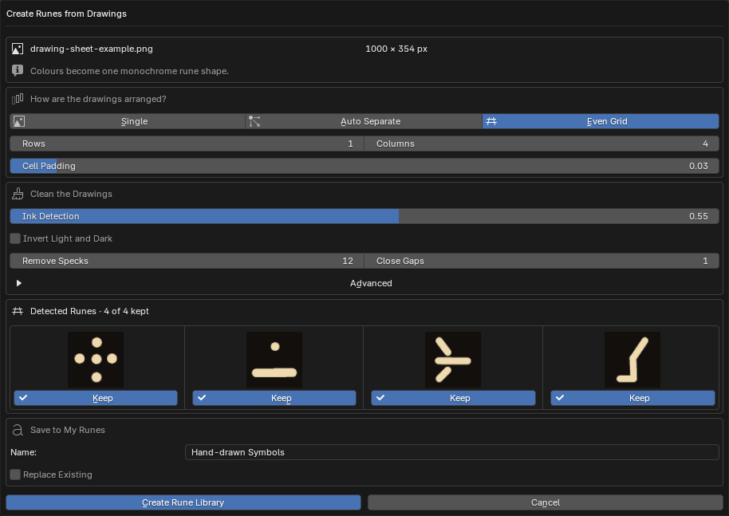{ .docs-shot loading=lazy width=914 height=647 }](../assets/images/runic/drawing-import-review.png)

## Troubleshooting and support

For common problems, see the [RUNIC FAQ](faq.md).

When reporting a problem, include your Blender version, RUNIC version, operating system, the path or object workflow you used, exact reproduction steps, and the full error message or a screenshot.
