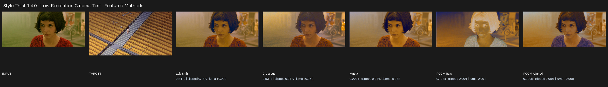

# Style Thief — FAQ

## Installation and compatibility

### Which Blender versions are supported?

Style Thief requires Blender 4.3 or newer. Install the complete release ZIP for your operating system.

### Are Blender 4.2 and older supported?

No. The minimum supported version is Blender 4.3.

### Why is the ZIP relatively large?

The ZIP contains everything Style Thief needs. You do not need to install anything separately.

## Results and methods

### Which method should I use?

Begin with **MK Ultra** and **Adaptive**. If the result is not the look you want, use **All Modes** to create every interpretation and choose visually.

Lab Shift is a useful fast option. Matrix and the Compound methods can produce stronger global palette movement. Crosscut offers a different distribution-based character. PCCM Raw and Aligned are useful when you want a more varied or creative alternative.

### Why can PCCM Raw look inverted, black, or completely wild?

Some image pairs can produce an inverted, unusually dark, or radically recoloured PCCM Raw result. This is expected behaviour. Choose **PCCM Aligned** for a more stable interpretation, or select **Both** and judge the results side by side.

### Is PCCM Aligned just an inverted PCCM Raw result?

No. It creates a separate, more stable interpretation intended to reduce unexpected inversions. Compare Raw and Aligned visually because the difference is not equivalent to making a simple image negative.

### Why does Strong sometimes look better than Adaptive?

Adaptive is a practical starting point, but it will not always be the best artistic result. On some image pairs—particularly creative PCCM Raw matches—Strong can be richer and preferable.

Compare the presets visually. Use Strong when you like the full transfer, Adaptive when you want automatic risk control, and Safe when retaining more of the source is more important.

### Why are Adaptive and Safe visibly different from Strong?

Adaptive and Safe retain more of the source image than Strong. They can affect midtones, saturation, highlights, shadows, and the overall palette—not only the strongest colours.

### Why are there presets instead of an Amount slider?

The three presets provide consistent choices across every method: Adaptive as the starting point, Strong for the boldest result, and Safe for greater source retention.

### Does Style Thief change image resolution or detail?

The result uses the source image's dimensions. The target may be a different size. Style Thief transfers colour character; it does not paste the target's shapes or texture detail into the source.

## Brightness, clipping, and colour profiles

### Why is my result washed out or much brighter than both images?

First check **Color Management → Input** and **Target**. A normal sRGB image interpreted as linear, or a linear/HDR image interpreted as sRGB, can cause large brightness and contrast errors.

Try this order:

1. Leave both profiles on Auto when the Blender image metadata is correct.
2. Force **sRGB** for normal photographs, screenshots, and most PNG/JPEG artwork.
3. Force **HDR / Linear** for scene-linear HDR or EXR images with values above 1.0.
4. Try Adaptive or Safe.
5. Compare another method; each method handles the target distribution differently.

### Can I match sRGB to HDR or HDR to sRGB?

Yes. Auto mode detects common sRGB, linear, and HDR cases. HDR targets are tone-mapped for analysis so their raw scene-linear brightness is not pushed directly into an sRGB source. HDR sources have their range reconstructed after matching.

If the metadata is wrong or ambiguous, set the profile manually. The **Input** setting describes the source image and **Target** describes the reference image; it does not refer to Blender's scene view transform.

### What is the difference between Linear and HDR / Linear?

Both describe linear-light pixels. Choose **Linear** when the values are meant to be linear but ordinary range handling is suitable. Choose **HDR / Linear** when values above 1.0 contain meaningful highlight range that should be tone-mapped for matching and reconstructed for the source result.

### Why does Style Thief warn about a Non-Color image?

Normal, roughness, metallic, mask, depth, and similar textures contain data rather than display colour. Colour matching changes those values and can break the material. The warning is there to prevent accidental use; choose a colour/albedo/base-colour image instead.

## Batch processing and output

### What is the difference between Batch Input and Batch Target?

- **Batch Input** applies one target style to many source images.
- **Batch Target** applies many target styles separately to one source image.

Use Batch Input to unify an image set. Use Batch Target to explore several looks for one image.

### What does All Modes do in a batch?

It runs all eleven outputs for every source/target pair. Both PCCM Raw and Aligned are included. The number of results grows quickly, so confirm the batch list and output directory before running it.

### Why is the run button disabled?

Style Thief enables **Steal That Style!** only when the selected processing mode has all required images and paths.

- Single needs one Source Image and one Target Image.
- Batch Input needs source images or a source directory, plus one Target Image.
- Batch Target needs one Source Image, plus target images or a target directory.
- A directory-based Batch Input also needs an Output Directory.
- Save To Directory needs a valid Output Directory.

### Where did my result go?

The most recent result appears in the Image Editor and in Blender's image datablocks. If **Save To Directory** is enabled, a file is also written to the chosen folder. Directory-based Batch Input writes results to its required output folder.

Enable **Set Fake User**, save the image externally, or pack it into the `.blend` file if it must survive after Blender considers it unused.

### Will Style Thief overwrite files or images?

The add-on reuses result image datablocks with the same result name rather than continuously creating `.001` copies. Saved files with the same output path and filename can also be replaced. Use separate folders or rename important iterations.

### What do the node options change?

**Add nodes near existing** creates result Image Texture nodes beside nodes that use the source image. **Add nodes and replace links** also transfers the source nodes' outgoing links to the generated result nodes. Choose **None** when you only want the image result.

## Performance and troubleshooting

### Why does Crosscut take longer?

Crosscut performs more processing than most other methods, particularly on 4K images.

Use a smaller copy for initial comparisons, or try Lab Shift for faster preview work. Run the full-resolution match after choosing a method.

### Why is All Modes slow?

All Modes performs eleven separate matches. Combining it with a batch multiplies that work by the number of source/target pairs. Run one representative pair first when developing a look.

### Why can the first operation take longer?

The first use in a Blender session may take longer while Style Thief prepares its image-processing components. Later operations avoid some of that setup.

### The screen-capture window is missing. What should I do?

Check the taskbar or other monitor. In Style Thief's add-on preferences, select the correct **Screen Grab Monitor** and try **Fast** if the Resizable window opens behind Blender. Fast is fixed-size; Resizable can be moved and enlarged.

### Clipboard paste does not work on Linux. What should I do?

Pillow may require a system clipboard helper such as `wl-clipboard` on Wayland or `xclip` on X11. Install the appropriate helper for your desktop, restart Blender, and copy an actual image rather than a file path or text.

## Support

### What should I include in a bug report?

Include:

- Blender version, Style Thief version, and operating system.
- Processing mode, method, strength, Input profile, and Target profile.
- Source and target images where their licences allow sharing.
- Exact steps that reproduce the problem.
- Complete error message from Blender's status area or system console.
- Screenshot of the Style Thief panel and the unexpected result.
