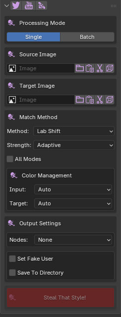
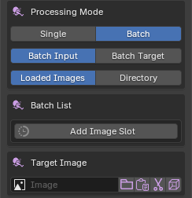
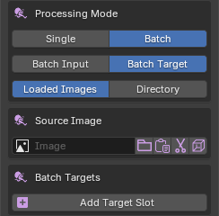
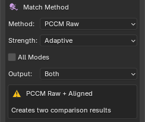
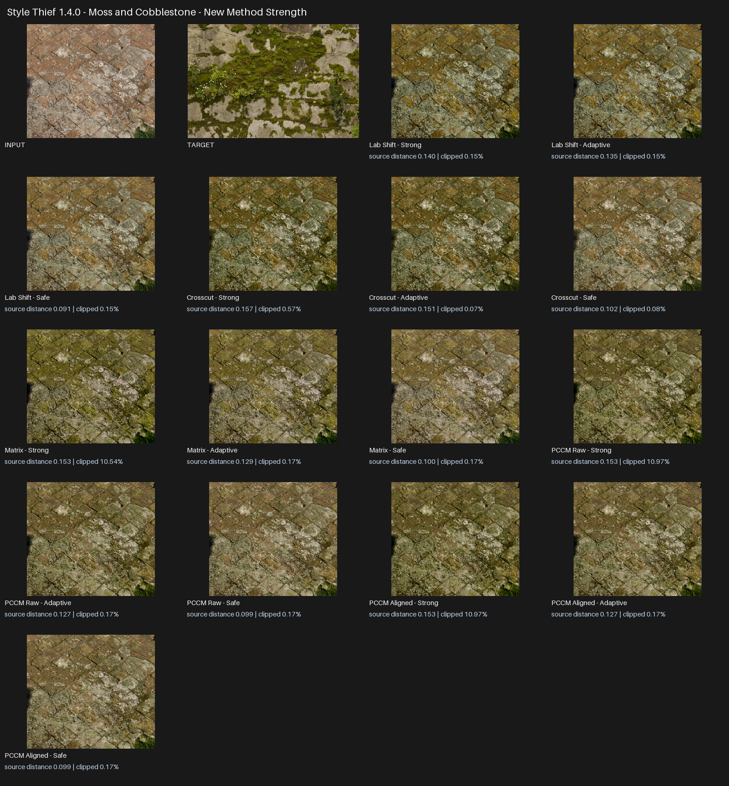
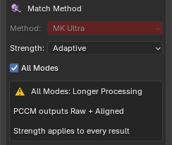

# Style Thief — User Guide

Style Thief recolours an input image using the colour distribution of a target image. It changes colour and tone, not the shapes or subject in the input, and produces a result at the input image's resolution.

## Installation

1. Download the Style Thief release ZIP.
2. Leave the ZIP intact; do not extract or rearrange its contents.
3. In Blender, open **Edit → Preferences → Get Extensions**.
4. Open the menu in the upper-right corner and choose **Install from Disk**.
5. Select the ZIP and enable **Style Thief** if Blender does not do so automatically.

The panel is in **Image Editor → Sidebar → Style Thief**. Press ++n++ while the pointer is over the Image Editor if its sidebar is hidden.

{ .docs-shot .docs-shot--compact loading=lazy width=244 height=636 }

## How colour matching works

The **Source Image** is the image that will be changed. The **Target Image** supplies the colour style to borrow. The result keeps the source composition, dimensions, and alpha channel where present.

The source and target do not need the same dimensions or show the same subject. Similar content or a compatible balance of light and dark areas can make the transfer more predictable, but contrasting images can produce useful creative results.

## Selecting images

The Source and Target rows provide several ways to choose an image.

| Control | Purpose |
| --- | --- |
| **Image field** | Choose an image already loaded in the current Blender file. |
| **Folder** | Load an image from disk. |
| **Paste** | Create a Blender image from an image currently on the system clipboard. |
| **Scissors** | Capture a rectangular region of a screen. |
| **Cube** | Choose an image used by an Image Texture node on the active object. This appears when an object is active. |
| **Cursor** | Display the assigned image in the current Image Editor. This appears after an image is assigned. |

For screen capture, drag over the required region and confirm with **Enter** or **Space**. Press **Esc** to cancel.

## Processing modes

### Single

Use **Single** for one source and one target.

1. Assign the Source Image and Target Image.
2. Choose a method and strength.
3. Check the Input and Target colour profiles.
4. Choose any output or node options.
5. Click **Steal That Style!**.

### Batch Input

**Batch Input** matches several source images to one target. It is useful for giving a set of textures, renders, or photographs a related palette.

1. Choose **Batch → Batch Input**.
2. Choose **Loaded Images** or **Directory**.
3. For Loaded Images, click **Add Image Slot** and assign each source. For Directory, select the source folder.
4. Assign one **Target Image**.
5. Choose the method, strength, and colour profiles.
6. Choose the output directory when required, then run the match.

Directory mode reads the supported image files in the selected folder in filename order and writes the results to the output directory. PNG, JPEG, BMP, TIFF, HDR, and EXR files are supported by directory processing.

{ .docs-shot .docs-shot--compact loading=lazy width=244 height=252 }

### Batch Target

**Batch Target** matches one source image separately to several targets. It is useful for generating look variations from one texture, render, or piece of artwork.

1. Choose **Batch → Batch Target**.
2. Assign one **Source Image**.
3. Choose **Loaded Images** or **Directory** for the targets.
4. For Loaded Images, click **Add Target Slot** and assign each target. For Directory, select the target folder.
5. Choose the method, strength, colour profiles, and output options.
6. Click **Steal That Style!**.

{ .docs-shot .docs-shot--compact loading=lazy width=244 height=240 }

## Matching methods

Different methods interpret the same image pair differently. Begin with **MK Ultra**, then compare alternatives when you want a different balance of colour, contrast, or intensity.

Want to judge every method on one fixed image pair? [Open the interactive matching-mode viewer](https://docs.bluenile.design/interactive-proof/?set=style-thief-matching-modes).

### Available methods

| Method | When to try it |
| --- | --- |
| **MK Ultra** | Start here for a balanced general-purpose result. |
| **Compound A** | Try when you want a stronger compound match or MK Ultra feels too restrained. |
| **Compound B** | Try for a different combination of histogram and colour-distribution matching. |
| **Raging Heart** | Useful for a natural global shift based on channel averages and variation. |
| **Spectrum** | Useful for smooth histogram-driven tonal and colour remapping. |
| **MV Gaussian** | Useful for a broad multivariate palette transfer. |
| **Lab Shift** | A fast option for direct, controlled palette changes and previews. |
| **Crosscut** | Offers a distinctive colour interpretation and is usually slower at high resolution. |
| **Matrix** | Produces a bold overall palette transfer. |
| **PCCM Raw** | A high-variance creative option. Inspect the result rather than assuming it will be physically intuitive. |
| **PCCM Aligned** | A more stable PCCM variation that reduces unexpected whole-image inversions. |

### PCCM output

When **PCCM Raw** is selected, the **Output** control appears:

- **Raw** creates the original high-variance PCCM interpretation.
- **Aligned** creates the more stable, direction-aligned interpretation.
- **Both** creates separate PCCM Raw and PCCM Aligned results for comparison.

{ .docs-shot .docs-shot--compact loading=lazy width=244 height=205 }

Depending on the image pair, PCCM Raw can look inverted, unusually dark, or radically recoloured. Choose Aligned for a more stable interpretation, or keep Raw when you prefer its more unpredictable result.

## Strength

Every method supports the same three artist-facing presets:

| Strength | Behaviour |
| --- | --- |
| **Adaptive** | Strong matching with automatic source-detail recovery when the proposed result has a higher clipping or out-of-range risk. Recommended starting point. |
| **Strong** | Produces the boldest transfer. Use it when Adaptive feels too restrained. |
| **Safe** | Blends more of the source character back into the result. Use when highlights, shadows, texture, or recognisable colours need more protection. |

Adaptive is not simply a weaker Strong preset. Its effect varies with the selected images, so Strong may still produce the preferred result. Judge the image rather than relying on the preset name.

## All Modes

Enable **All Modes** to generate all eleven outputs from the current source and target pair. The selected Method is disabled because every method is used. The chosen Strength applies to every result, and both PCCM Raw and PCCM Aligned are created.

{ .docs-shot .docs-shot--compact loading=lazy width=244 height=205 }

All Modes is intended for look development and comparison. It takes longer and can create many images in Blender, particularly when combined with a batch mode.

## Colour management

Set **Input** to describe the Source Image and **Target** to describe the Target Image. Leave both on **Auto** for normal use:

| Profile | Use it for |
| --- | --- |
| **Auto** | Recommended. Uses Blender image metadata, file type, float status, and pixel range to infer the profile. |
| **sRGB** | Standard display-referred photographs, screenshots, web images, and most PNG/JPEG artwork. |
| **Linear** | Linear-light images whose values should be interpreted as scene-linear but do not require HDR range reconstruction. |
| **HDR / Linear** | Scene-linear HDR or EXR imagery whose values can exceed 1.0 and whose dynamic range should be retained. |

Use the override when Auto has incomplete or misleading metadata. For example, select **sRGB** for a normal photograph that was incorrectly tagged Linear, or **HDR / Linear** for an HDRI whose brightest values must remain above 1.0.

Style Thief supports matching between normal sRGB images and linear or HDR images. Choosing the correct profiles helps prevent unexpected brightness, contrast, and colour changes.

!!! note

    Style Thief is intended for colour imagery. Do not use a colour match on normal maps, roughness maps, masks, depth maps, or other data textures. Blender images tagged Non-Color, Raw, or Data trigger a console warning because recolouring them changes their numeric meaning.

## Output settings

### Blender images and Fake User

By default, results are created as Blender image datablocks. **Set Fake User** protects generated images from being removed as unused data when the `.blend` file is reopened.

Generated images are not automatically external files unless **Save To Directory** is enabled or a directory-based Batch Input requires file output. Save important images to disk or pack them into the `.blend` file.

### Save To Directory

Enable **Save To Directory**, choose an **Output Directory**, and run the match. The result name includes the friendly method name, such as `MK_Ultra`, `Lab_Shift`, `Crosscut`, `Matrix`, `PCCM_Raw`, or `PCCM_Aligned`.

For Batch Target, filenames also identify the source and target. Running the same operation again can overwrite an existing file with the same path and name, so use a dedicated output directory when preserving iterations.

LDR sources retain a suitable LDR extension. HDR and EXR sources can retain HDR output when their HDR range is being preserved.

### Shader nodes

The **Nodes** menu controls integration with Image Texture nodes:

- **None** makes no node changes.
- **Add nodes near existing** creates result Image Texture nodes near Image Texture nodes using the source image.
- **Add nodes and replace links** creates the result nodes and transfers the source node's outgoing links to them.

In Single mode, **Replace Source Image with Result Image** also replaces the Source Image field with the new result after link replacement.

Use node actions on a copy of a material when you want to compare the original and recoloured setups safely.

## Preferences

Open Style Thief in Blender's add-on preferences to change:

| Preference | Purpose |
| --- | --- |
| **Screen Grab Monitor** | Capture the first monitor, second monitor, or the combined desktop. |
| **Screen Grab Mode: Resizable** | Opens a resizable selection window. It can take longer to appear and may open behind Blender. |
| **Screen Grab Mode: Fast** | Opens a fixed-size selection window more quickly and attempts to keep it on top. |
| **Rename Suffix / Prefix** | Places the method name after or before the source/result name. |

## Improving results

- Start with MK Ultra and Adaptive, then compare methods rather than forcing one method to suit every pair.
- Use All Modes at a reduced resolution during look development if the full images are very large.
- Try Strong when Adaptive is too restrained, and Safe when highlights or recognisable source colours need more protection.
- For PCCM, compare Raw and Aligned. A strange Raw result does not imply that Aligned will also fail.
- Check Input and Target colour profiles whenever a result is unexpectedly bright, dark, flat, or low contrast.
- Use colour targets rather than data textures, and avoid almost monochrome targets unless a deliberately narrow palette is wanted.
- Compare the result at 100% zoom when checking banding, pixelation, clipping, or texture detail.

## Troubleshooting and support

For common problems, see the [Style Thief FAQ](faq.md).

When reporting a problem, include the Blender version, Style Thief version, operating system, source and target images where licensing allows, processing mode, method, strength, colour profiles, exact reproduction steps, and the complete error message. A screenshot of the panel and result is also useful.
